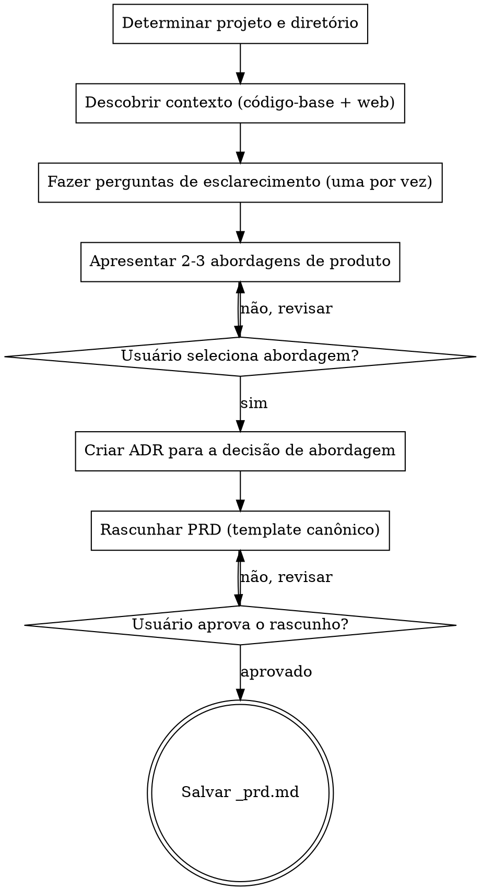

# Create PRD

Crie um Documento de Requisitos de Produto (PRD) focado em negócio por meio de brainstorming estruturado.

<HARD-GATE>
NÃO escreva o arquivo do PRD até que TODAS as fases estejam concluídas e o usuário tenha aprovado a versão final.
NÃO pule a fase de pesquisa — todo PRD DEVE ser enriquecido com contexto do código-base e de mercado.
NÃO pule as interações com o usuário — o usuário DEVE participar da construção do PRD em cada ponto de decisão.
NÃO exija aprovação seção por seção — gere o rascunho completo e então deixe o usuário revisá-lo.
Isso se aplica a TODO PRD, independentemente da simplicidade percebida.
</HARD-GATE>

## Como Fazer Perguntas

Quando esta skill instruir você a fazer uma pergunta ao usuário, você DEVE usar a ferramenta interativa de perguntas dedicada do seu runtime — a ferramenta ou função que apresenta uma pergunta ao usuário e **pausa a execução até o usuário responder**. Não emita perguntas como texto comum do assistente e continue gerando; sempre use o mecanismo que bloqueia até o usuário responder.

Se o seu runtime não fornecer tal ferramenta, apresente a pergunta como sua mensagem completa e pare de gerar. Não responda à sua própria pergunta nem prossiga sem a entrada do usuário.

## Antipadrão: "Esta Feature É Simples Demais Para Brainstorming Completo"

Todo PRD passa pelo processo completo de brainstorming. Um único botão, um ajuste menor de fluxo, uma opção de configuração — todos eles. Features "simples" são onde premissas de negócio não examinadas causam o maior retrabalho. O brainstorming pode ser breve para features genuinamente simples, mas você DEVE fazer perguntas de esclarecimento e obter aprovação sobre a abordagem de produto antes de escrever o artefato.

## Antipadrão: Burocracia no Fim do Fluxo

Depois que o usuário respondeu às perguntas de esclarecimento e aprovou uma abordagem, não o force a passar por um segundo ciclo de aprovação para Visão Geral, Objetivos, Histórias de Usuário ou qualquer outra seção final do documento. Sintetize a direção aprovada diretamente no PRD. O usuário pode revisar e solicitar edições no arquivo gerado depois.

## Antipadrão: Desvio Técnico em Features de Aparência Técnica

Quando o nome da feature soa técnico (ex.: "notificações por webhook", "exportação CSV", "modo escuro", "rate limiting de API"), você será tentado a discutir COMO implementá-la. Resista a isso. Seu trabalho é o QUÊ e o PORQUÊ:

- ERRADO: "Devemos usar WebSockets ou polling para as notificações?" (implementação)
- ERRADO: "Qual formato de biblioteca CSV devemos mirar?" (implementação)
- CERTO: "Quais eventos devem disparar uma notificação ao usuário?" (necessidade do usuário)
- CERTO: "Quais informações os usuários precisam nos relatórios exportados?" (necessidade do usuário)

Traduza toda feature de aparência técnica para a pergunta de experiência do usuário por trás dela.

## Entradas Necessárias

- Nome da feature ou ideia de produto.
- Opcional: arquivo `_idea.md` existente como entrada primária de contexto.
- Opcional: arquivo `_prd.md` existente para modo de atualização.

## Checklist

Você DEVE criar uma tarefa para cada fase e concluí-las em ordem:

1. **Determinar projeto e diretório** — derivar o slug, criar `.specs/<slug>/` e `adrs/`
2. **Descobrir contexto** — exploração paralela do código-base e pesquisa na web
3. **Entender a necessidade** — fazer 3-6 perguntas direcionadas para refinar escopo e intenção
4. **Apresentar abordagens de produto** — oferecer 2-3 abordagens com trade-offs, criar ADR para a escolhida
5. **Rascunhar o PRD** — escrever usando o template canônico de `references/prd-template.md`
6. **Revisar com o usuário** — apresentar o rascunho, iterar até a aprovação
7. **Salvar o arquivo** — gravar em `.specs/<slug>/_prd.md`

## Fluxo de Trabalho

1. Determine o nome do projeto e o diretório de trabalho.
   - Derive o slug a partir do nome da feature fornecido pelo usuário.
   - Use `.specs/<slug>/` como diretório de destino.
   - Se `_idea.md` existir no diretório de destino, leia-o como entrada primária de contexto.
   - Se `_prd.md` já existir no diretório de destino, leia-o e opere em modo de atualização.
   - Se o diretório não existir, crie-o.
   - Crie o diretório `.specs/<slug>/adrs/` se ele não existir.

2. Descubra contexto por meio de pesquisa paralela. Você DEVE realizar AMBAS as trilhas antes de fazer qualquer pergunta.

   **Trilha A — Exploração do código-base** (OBRIGATÓRIA):
   - Pesquise no código-base por arquivos, padrões e features relacionados à solicitação do usuário.
   - Procure por implementações existentes, modelos de dados e pontos de integração que sejam relevantes.
   - Resuma o que você encontrou em 3-5 bullet points.

   **Trilha B — Pesquisa de mercado e usuário** (OBRIGATÓRIA):
   - Realize 3-5 buscas na web sobre tendências de mercado, produtos concorrentes e necessidades de usuário relacionadas à feature.
   - Procure como produtos similares resolvem esse problema e o que os usuários esperam.
   - Resuma o que você encontrou em 3-5 bullet points.

   Execute ambas as trilhas em paralelo (ex.: duas chamadas da ferramenta Agent, dois lotes de busca etc.). Apresente ao usuário um breve resumo combinado dos achados de AMBAS as trilhas antes de passar às perguntas. Se ferramentas de busca na web estiverem indisponíveis, registre a limitação explicitamente e prossiga apenas com os achados do código-base.

3. Faça perguntas de esclarecimento seguindo `references/question-protocol.md`.
   - Foque exclusivamente em QUAIS features os usuários precisam, POR QUE isso traz valor de negócio e QUEM são os usuários-alvo.
   - Pergunte sobre critérios de sucesso e restrições.
   - Nunca faça perguntas de implementação técnica sobre bancos de dados, APIs, frameworks ou arquitetura.
   - **UMA pergunta por mensagem — rigorosamente exigido.** Sua mensagem deve conter exatamente um ponto de interrogação. Após fazer a pergunta, PARE. Não adicione perguntas de acompanhamento, perguntas com "também" ou prompts "adicionalmente". Se um tópico precisar de mais exploração, faça o acompanhamento na PRÓXIMA mensagem após o usuário responder.

     Antipadrão (PROIBIDO):
     "Qual é a persona de usuário principal? Também, quais são as principais métricas de sucesso?"
     Isso são DUAS perguntas. Divida-as em duas mensagens separadas.

   - Toda pergunta DEVE ser de múltipla escolha quando opções razoáveis puderem ser predeterminadas. Formate como opções rotuladas (A, B, C etc.) para que o usuário possa responder com uma única letra. Use perguntas abertas apenas quando o espaço de respostas for genuinamente ilimitado (ex.: "Qual problema você está tentando resolver?").
   - Inclua uma opção de fallback (ex.: "D) Outro — descreva") para flexibilidade.
   - Para features complexas com muitas dimensões, decomponha em subtópicos e pergunte sobre uma dimensão por vez. Cada subtópico normalmente tem opções predetermináveis. Exemplo: em vez da pergunta aberta "O que a feature de colaboração deve incluir?", pergunte "Qual aspecto da colaboração em equipe é mais importante para começar? A) Workspaces compartilhados B) Presença em tempo real C) Controles de permissão D) Feeds de atividade".
   - Conclua ao menos uma rodada completa de esclarecimento antes de apresentar abordagens.

4. Apresente abordagens de produto.
   - Ofereça 2-3 abordagens de produto com trade-offs para cada uma.
   - Comece pela abordagem recomendada e explique por que ela é preferida.
   - Aguarde o usuário selecionar uma abordagem antes de continuar.
   - Após o usuário selecionar uma abordagem, crie um ADR para essa decisão:
     - Leia `references/adr-template.md`.
     - Determine o próximo número de ADR listando os arquivos existentes em `.specs/<slug>/adrs/`.
     - Preencha o template: a abordagem selecionada como "Decisão", as abordagens rejeitadas como "Alternativas Consideradas" com seus trade-offs, e os resultados como "Consequências". Defina o Status como "Aceito" e a Data como hoje.
     - Grave o ADR em `.specs/<slug>/adrs/adr-NNN.md` (número de 3 dígitos com zeros à esquerda, ex.: `adr-001.md`).

5. Rascunhe o PRD.
   - Após o usuário selecionar uma abordagem, sintetize o design final de produto. Não apresente cada seção para aprovação separada.
   - Se o usuário tomar uma decisão significativa de escopo durante o esclarecimento ou a seleção de abordagem, crie um ADR adicional seguindo o mesmo processo do passo 4.
   - Só pause antes de escrever se restar uma ambiguidade bloqueante que forçaria adivinhação; caso contrário, prossiga diretamente para a geração do documento.
   - Leia `references/prd-template.md` e preencha cada seção com o contexto coletado.
   - Inclua uma seção "Architecture Decision Records" listando todos os ADRs criados nesta sessão, com seus números, títulos e resumos de uma linha como links para o diretório `adrs/`.
   - Aplique YAGNI sem dó: questione cada feature e remova tudo que o MVP não precisa.
   - O PRD deve descrever apenas capacidades de usuário e resultados de negócio.
   - Sem bancos de dados, APIs, estrutura de código, frameworks, estratégias de teste ou decisões de arquitetura.
   - Seções obrigatórias (SEMPRE incluir): Visão Geral, Objetivos, Histórias de Usuário, Features Principais, Experiência do Usuário, Não-Objetivos, Plano de Lançamento em Fases, Métricas de Sucesso, Riscos e Mitigações, Architecture Decision Records, Questões em Aberto.
   - Seções opcionais (incluir quando relevante): Restrições Técnicas de Alto Nível.
   - Prefira voz ativa, omita palavras desnecessárias, use linguagem definida e específica em vez de generalidades vagas. Cada frase deve justificar sua presença.
   - Idioma: **Português do Brasil (pt-BR)**. Tom: claro, técnico, consistente com os artefatos existentes do projeto.
   - Apresente o rascunho completo ao usuário para revisão.

6. Revise com o usuário.
   - Apresente o rascunho e pergunte usando a ferramenta interativa de perguntas:
     - "Aqui está o rascunho do PRD. Por favor, revise e me diga:"
     - A) Aprovado — salvar como está
     - B) Ajustar seções específicas (diga quais)
     - C) Reescrever a seção X (diga o que mudar)
     - D) Descartar e recomeçar
   - Se B ou C: faça as alterações e apresente novamente.
   - Se D: volte ao passo 3.

7. Salve o arquivo do PRD.
   - Grave o documento concluído em `.specs/<slug>/_prd.md`.
   - Confirme o caminho do arquivo ao usuário.
   - Lembre o usuário de que o próximo passo é criar um TechSpec usando `create-techspec` a partir deste PRD.

## Fluxo do Processo

## Tratamento de Erros

- Se o usuário fornecer contexto insuficiente para completar uma seção, registre isso na seção Questões em Aberto em vez de adivinhar.
- Se as ferramentas de pesquisa na web estiverem indisponíveis, prossiga apenas com a exploração do código-base e registre a limitação.
- Se o diretório de destino não puder ser criado, pare e reporte o erro de sistema de arquivos.
- Se estiver operando em modo de atualização, preserve as seções que o usuário não pediu para alterar.

## Princípios-Chave

- **Uma pergunta por vez** — Não sobrecarregue com múltiplas perguntas em uma única mensagem
- **Múltipla escolha obrigatória** — Toda pergunta DEVE ser de múltipla escolha (A/B/C) quando as opções puderem ser predeterminadas; aberta apenas quando o espaço de respostas for genuinamente ilimitado
- **YAGNI sem dó** — Questione cada feature; remova tudo que o MVP não precisa
- **Rascunhar e revisar** — Obtenha aprovação da abordagem de produto, gere o rascunho completo e então itere com o usuário até a aprovação
- **Foco apenas em negócio** — Nunca pergunte sobre implementação; isso pertence ao TechSpec
- **Ideia como entrada** — Quando `_idea.md` existir, use-o como contexto primário para acelerar o brainstorming
- **Consciência do pipeline** — O PRD alimenta o `create-techspec`; foque no QUÊ e no PORQUÊ, não no COMO
- **Conformidade com o template** — Todo PRD DEVE seguir o template canônico
- **Consistência de idioma** — Escreva todo o conteúdo do PRD em Português do Brasil (pt-BR)
