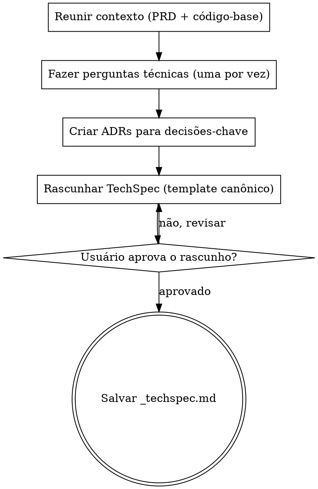

# Create TechSpec

Traduza requisitos de negócio em uma especificação técnica detalhada.

<HARD-GATE>
NÃO escreva o arquivo do TechSpec até que TODAS as fases estejam concluídas e o usuário tenha aprovado a versão final.
NÃO pule a exploração do código-base — todo TechSpec DEVE ser informado pela arquitetura existente.
NÃO pule as interações com o usuário — o usuário DEVE participar da construção do TechSpec em cada ponto de decisão.
NÃO exija aprovação seção por seção — gere o rascunho completo e então deixe o usuário revisá-lo.
Isso se aplica a TODO TechSpec, independentemente da simplicidade percebida.
</HARD-GATE>

## Como Fazer Perguntas

Quando esta skill instruir você a fazer uma pergunta ao usuário, você DEVE usar a ferramenta interativa de perguntas dedicada do seu runtime — a ferramenta ou função que apresenta uma pergunta ao usuário e **pausa a execução até o usuário responder**. Não emita perguntas como texto comum do assistente e continue gerando; sempre use o mecanismo que bloqueia até o usuário responder.

Se o seu runtime não fornecer tal ferramenta, apresente a pergunta como sua mensagem completa e pare de gerar. Não responda à sua própria pergunta nem prossiga sem a entrada do usuário.

## Antipadrão: "Isto É Simples Demais Para Precisar de Revisão de Design Técnico"

Todo TechSpec passa pelo processo completo de revisão de design. Um único endpoint, uma refatoração menor, uma mudança de configuração — todos eles. Mudanças técnicas "simples" são onde premissas não examinadas sobre a arquitetura existente causam as maiores falhas de integração. A revisão de design pode ser breve para mudanças genuinamente simples, mas você DEVE fazer perguntas de esclarecimento técnico e obter aprovação sobre a abordagem técnica antes de escrever o artefato.

## Antipadrão: Burocracia no Fim do Fluxo

Depois que o usuário respondeu às perguntas de esclarecimento técnico e aprovou uma abordagem, não o force a passar por um segundo ciclo de aprovação para Arquitetura do Sistema, Modelos de Dados, Design de API ou outras seções finais do documento. Sintetize a direção aprovada diretamente no TechSpec. O usuário pode revisar e solicitar edições no arquivo gerado depois.

## Entradas Necessárias

- Nome da feature que identifica o diretório `.specs/<name>/`.
- Opcional: `_prd.md` existente como entrada primária.
- Opcional: `_techspec.md` existente para modo de atualização.

## Checklist

Você DEVE criar uma tarefa para cada fase e concluí-las em ordem:

1. **Reunir contexto** — ler o PRD, os ADRs e explorar a arquitetura do código-base
2. **Fazer perguntas técnicas** — 3-6 perguntas direcionadas sobre arquitetura, modelos de dados, APIs, testes
3. **Criar ADRs** — registrar decisões técnicas significativas (padrão de arquitetura, escolhas de tecnologia, abordagem de modelo de dados)
4. **Rascunhar o TechSpec** — escrever usando o template canônico de `references/techspec-template.md`
5. **Revisar com o usuário** — apresentar o rascunho, iterar até a aprovação
6. **Salvar o arquivo** — gravar em `.specs/<name>/_techspec.md`

## Fluxo de Trabalho

1. Reúna o contexto.
   - Verifique se há `_prd.md` em `.specs/<name>/`. Se existir, leia-o como entrada primária.
   - Se não houver PRD, peça ao usuário uma descrição do que precisa de especificação técnica.
   - Leia os ADRs existentes em `.specs/<name>/adrs/` para entender as decisões já tomadas durante a criação do PRD.
   - Crie o diretório `.specs/<name>/adrs/` se ele não existir.
   - Dispare uma chamada da ferramenta Agent para explorar o código-base em busca de padrões de arquitetura, componentes existentes, dependências e stack de tecnologia.
   - Se `_techspec.md` já existir, leia-o e opere em modo de atualização.

2. Faça perguntas de esclarecimento técnico.
   - Foque em COMO implementar, ONDE os componentes residem e QUAIS tecnologias usar.
   - Cubra a abordagem de arquitetura e os limites dos componentes.
   - Cubra os modelos de dados e escolhas de armazenamento.
   - Cubra o design de API e os pontos de integração.
   - Cubra a estratégia de testes e os requisitos de desempenho.
   - Faça apenas uma pergunta por mensagem. Se um tópico precisar de mais exploração, divida-o em uma sequência de perguntas individuais.
   - Prefira perguntas de múltipla escolha quando as opções puderem ser predeterminadas.
   - Inclua uma opção de fallback (ex.: "D) Outro — descreva") para flexibilidade.

3. Crie ADRs para decisões técnicas significativas.
   - Para cada decisão significativa (padrão de arquitetura escolhido, tecnologia selecionada, abordagem de modelo de dados etc.):
     - Leia `references/adr-template.md`.
     - Determine o próximo número de ADR listando os arquivos existentes em `.specs/<name>/adrs/`.
     - Preencha o template: o design escolhido como "Decisão", as alternativas rejeitadas como "Alternativas Consideradas" e os trade-offs como "Consequências". Defina o Status como "Aceito" e a Data como hoje.
     - Grave cada ADR em `.specs/<name>/adrs/adr-NNN.md` (número sequencial de 3 dígitos com zeros à esquerda).

4. Rascunhe o TechSpec.
   - Leia `references/techspec-template.md` e preencha cada seção aplicável.
   - **OBRIGATÓRIO — seção Architecture Decision Records:** O TechSpec gerado DEVE terminar com uma seção "Architecture Decision Records" listando cada ADR criado durante este processo. Cada entrada deve incluir o número do ADR (ex.: ADR-001), o título e um resumo de uma linha formatado como link para o diretório `adrs/`. Mesmo features simples exigem ao menos um ADR documentando a abordagem técnica principal escolhida e as alternativas rejeitadas. Se nenhum ADR foi criado no passo 3, volte e crie ao menos um antes de gerar o documento.
   - Aplique YAGNI sem dó: remova qualquer componente, interface ou abstração que não seja estritamente necessário. NÃO proponha novos pacotes ou diretórios quando a feature puder ser implementada adicionando um único arquivo a um pacote existente.
   - Cada objetivo do PRD e história de usuário deve mapear para um componente técnico.
   - Referencie as seções do PRD pelo nome, mas não duplique o contexto de negócio.
   - Inclua exemplos de código apenas para interfaces centrais, limitados a 20 linhas cada. A seção Core Interfaces deve conter ao menos uma definição de interface ou struct Go como bloco de código, mesmo para features simples — mostre o tipo principal do qual outros componentes vão depender.
   - A seção Development Sequencing DEVE incluir uma Build Order numerada onde cada passo após o primeiro declara explicitamente de quais passos anteriores depende.
   - Prefira voz ativa, omita palavras desnecessárias, use linguagem definida e específica em vez de generalidades vagas. Cada frase deve justificar sua presença.
   - Idioma: **Português do Brasil (pt-BR)**. Tom: claro, técnico, consistente com os artefatos existentes do projeto.
   - Apresente o rascunho completo ao usuário para revisão.

5. Revise com o usuário.
   - Apresente o rascunho e pergunte usando a ferramenta interativa de perguntas:
     - "Aqui está o rascunho do TechSpec. Por favor, revise e me diga:"
     - A) Aprovado — salvar como está
     - B) Ajustar seções específicas (diga quais)
     - C) Reescrever a seção X (diga o que mudar)
     - D) Descartar e recomeçar
   - Se B ou C: faça as alterações e apresente novamente.
   - Se D: volte ao passo 2.

6. Salve o arquivo do TechSpec.
   - Grave o documento concluído em `.specs/<name>/_techspec.md`.
   - Confirme o caminho do arquivo ao usuário.
   - Lembre o usuário de que o próximo passo é criar tarefas usando `create-tasks` a partir deste TechSpec.

## Fluxo do Processo

## Tratamento de Erros

- Se o PRD estiver ausente, prossiga com o contexto fornecido pelo usuário e registre a ausência no Resumo Executivo.
- Se a exploração do código-base revelar padrões arquiteturais conflitantes, documente ambos e recomende um com justificativa.
- Se o usuário rejeitar a proposta de design, incorpore todo o feedback e apresente uma proposta revisada.
- Se o diretório de destino não existir, crie-o.
- Se estiver operando em modo de atualização, preserve as seções que o usuário não pediu para alterar.

## Princípios-Chave

- **Uma pergunta por vez** — Não sobrecarregue com múltiplas perguntas em uma única mensagem
- **Múltipla escolha preferida** — Mais fácil de responder que aberta, quando possível
- **YAGNI sem dó** — Remova componentes, abstrações e interfaces desnecessários de todos os designs
- **Rascunhar e revisar** — Gere primeiro o rascunho completo do TechSpec e então itere com o usuário até a aprovação
- **Foco apenas técnico** — Nunca faça perguntas de negócio; isso pertence ao PRD
- **Trade-offs são obrigatórios** — Todo Resumo Executivo deve declarar o principal trade-off técnico da abordagem escolhida
- **PRD como entrada** — Quando `_prd.md` existir, use-o como contexto primário; cada objetivo do PRD deve mapear para um componente técnico
- **Consciência do pipeline** — O TechSpec alimenta o `create-tasks`; foque no COMO, não no QUÊ ou no PORQUÊ
- **Conformidade com o template** — Todo TechSpec DEVE seguir o template canônico
- **Consistência de idioma** — Escreva todo o conteúdo do TechSpec em Português do Brasil (pt-BR)
